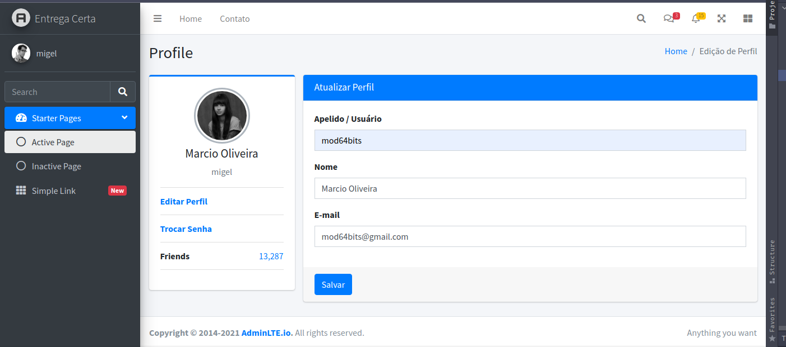
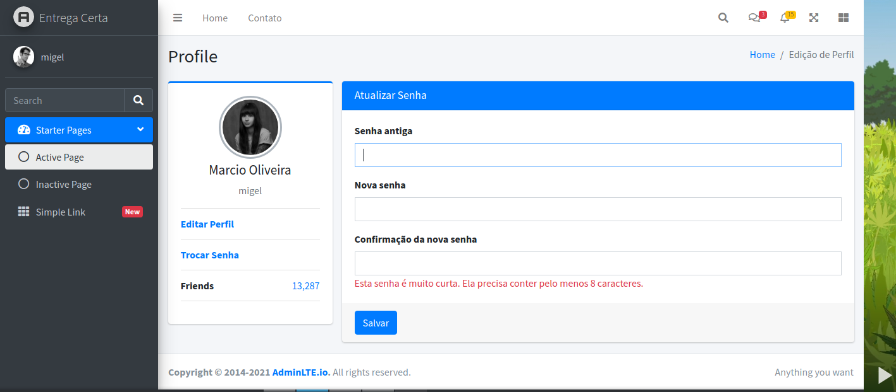

# Entrega Certa

## About

Sistema destinado para o controle de correspondência de condomínios. 
sistema em desenvolvimento. 

<h1 align="center">
    <a href="https://www.djangoproject.com/">🔗 Python & Django</a>
</h1>

🚀 Não existem métodos fáceis para resolver problemas difíceis.

<h1 align="center">
    <h4 align="center">🔗 Python & Django Template 
 <a href="https://adminlte.io/">Admin LTE</a>
</h4>
</h1>

<h4 align="center"> 
	🚧  Projeto em 🚀 Em construção...  🚧
</h4>

### Features
- [X] Start Project
- [X] App Usuários
- [] App Condômino
- [] App Endereços 
- [] App Entrada de Entrega 
- [] App Entrega
- [] App Notificação WhatsApp

### 📸 screenshots app OLT

